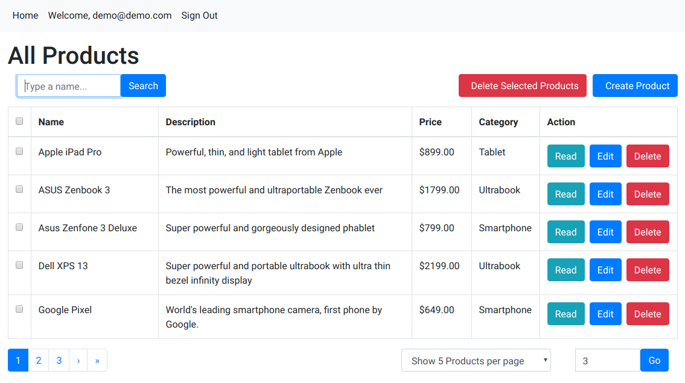
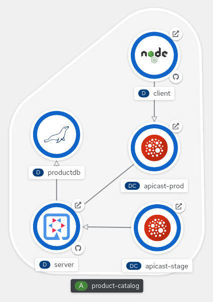

= 3scale Demo with Product Catalog

This is a 3scale demo that leverages the product-catalog application which is used in some of my gitops demos. This demo places an APICast gateway between the nodejs client and the quarkus backend to manage API access.



The topology view in OpenShift shows the three tiers of the application along with the apicast gateways:




= Pre-Requisites

* You must have a https://access.redhat.com/documentation/en-us/red_hat_3scale_api_management/2.13/html/installing_3scale/install-threescale-on-openshift-guide#evaluation_installation[3scale API Manager] either installed in your local cluster or use the hosted SaaS version.

= Installation

== Variables

```shell
$ export CLUSTER_WILDCARD_DOMAIN=$(oc whoami --show-console 2> /dev/null | cut -d '.' -f2- | cut -d ':' -f1)
$ CLUSTER_NAME=$(echo $CLUSTER_WILDCARD_DOMAIN | cut -d '.' -f1)
$ CLUSTER_DOMAIN=$(echo $CLUSTER_WILDCARD_DOMAIN | cut -d '.' -f2)
$ THRESCALE_NS=3scale
$ DEMO_NS=product-catalog
```

== Steps
To use this demo perform the following steps:

. Clone this repo

. Copy the `clusters/template` folder, with it's subdirectores intact, as a peer folder and rename it to the name of your cluster.
+
NOTE: In the `clusters/local.home` there is an example, so you need to make a third cluster that reflects your cluster.
+
```shell
$ cp -r clusters/template clusters/${CLUSTER_NAME}
```

. In your new cluster folder, modify patch.yaml to reflect the cluster name and wildcard in use for your cluster
+
```shell
$ sed -i "s/<cluster-name>/${CLUSTER_NAME}/g" clusters/${CLUSTER_NAME}/overlays/3scale/patch.yaml
$ sed -i "s/<domain>/${CLUSTER_DOMAIN}/g" clusters/${CLUSTER_NAME}/overlays/3scale/patch.yaml
```
. Install the application using kustomize:
+
```shell
# to view what will be installed
$ oc kustomize clusters/${CLUSTER_NAME}/overlays/3scale

# to install
$ oc apply -k clusters/${CLUSTER_NAME}/overlays/3scale
```

. You will need to provide a **Secret** in order for the **apicast gateway** to connect to your API Manager portal,
+
[NOTE]
- At `clusters/local.home` has a sealed-secret in `api-url-config-sealed-secret.yaml`.
- If you want to store your secret in Git you will need to create by your own - creating a secret is covered in the https://access.redhat.com/documentation/en-us/red_hat_3scale_api_management/2.13/html/admin_portal_guide/tokens#creating-access-tokens[Creating access tokens] and https://access.redhat.com/documentation/en-us/red_hat_3scale_api_management/2.13/html-single/operating_3scale/index#api-lifecycle-deploy-apicast-3scale[3scale documentation]
+
[TIP]
+
```shell
# get the credential to acces the admin portal
$ oc -n $THRESCALE_NS extract secret/system-seed --keys=ADMIN_USER,ADMIN_PASSWORD --to=-

# get "3scale-admin" url
$ export THRESCALE_ADMIN_HOST=$(oc -n $THRESCALE_NS  get $(oc -n $THRESCALE_NS get route -l zync.3scale.net/route-to=system-provider -o=name) -o=jsonpath='{.spec.host}')

# Create the Token
$ echo "https://${THRESCALE_ADMIN_HOST}/p/admin/user/access_tokens/new"
```
+
```shell
# oc project product-catalog
export ACCESS_TOKEN=ae12e651ab5aba326bb922382478d77a4a55abd66a801f3c812b416088085f64

# create the demo project
$ oc new-project $DEMO_NS

# create into the APICAST product namespace
$ oc -n $DEMO_NS create secret generic 3scaleportal \
    --from-literal=AdminPortalURL=https://${ACCESS_TOKEN}@https://${THRESCALE_ADMIN_HOST}
```

. Import the API into your 3scale instance using the included`scripts/import-product-catalog-api` script.

```shell
$ sh scripts/import-product-catalog-api.sh
```

. Go into the *3scale admin portal*, and at see the Product created `product-catalog`:
.. create application plans using API keys.
... I usually create two plans, one `unlimited` plan and one `trial` plan limiting the rate to `5` per minute. Publish the application plans when finished.
.. Update the Policy for the integration to include the CORS policy first (leave origin blank) and remove the anonymous policy
.. Create a group in Audience along with a User and add an application.
... I typically create a Test app using the Trial plan and a Production app using the Unlimited plan. Edit the application key for the Production app to be `18de534a3ed3131245a2ecc7638853c1`, this is what is configured in the client. If you do not want to use this key you need to update the client config map with the desired key and restart the client pod. Depending on your account and app settings you may need to approve the new group and application in the admin portal.
+
. Test the nodejs application to ensure it shows the product listing.

[TIP]
If it's stuck on "loading..." use the browser Developer tools to see what's happening.

== References

* https://access.redhat.com/documentation/en-us/red_hat_3scale_api_management/2.13/html/installing_3scale/installing-apicast#deploying-apicast-gateway-self-managed-operator[Deploying an APIcast gateway self-managed solution using the operator]


```shell
oc set volume deploy/client --add -t configmap --mount-path=/opt/app-root/src/config.js --sub-path=config.js --name=client-conf --configmap-name=client --overwrite
```


== References
. https://base64.guru/converter/encode/image/ico
. https://access.redhat.com/solutions/5727181[How to roll back Deployments in the Web Console in OpenShift 4]

